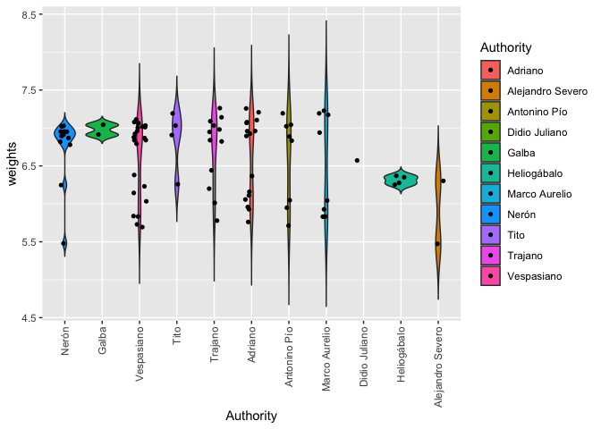

Aureus boxplot
================
Agustín Diez Castllo
4/21/2022
[](https://zenodo.org/badge/latestdoi/276396809)

This is an [R Markdown](http://rmarkdown.rstudio.com) Notebook. When you
execute code within the notebook, the results appear beneath the code.

Try executing this chunk by clicking the *Run* button within the chunk
or by placing your cursor inside it and pressing *Cmd+Shift+Enter* or
*Ctrl+Shift+Enter* if you’re not in a Mac.

``` r
if (!require("ggplot2")) install.packages("ggplot2")
```

    ## Loading required package: ggplot2

``` r
library(ggplot2)
```

Add a new chunk by clicking the *Insert Chunk* button on the toolbar or
by pressing *Cmd+Option+I*.

When you save the notebook, an HTML file containing the code and output
will be saved alongside it (click the *Preview* button or press
*Cmd+Shift+K* to preview the HTML file).

But let see an example with golden coins from roman times. We got 91
coins from diferent authorities that have been found in Hispania and we
like to see if there are some differences in weight thru time. First
we’ve weighted each of the aureus (this is how the Romans called their
golden coins) and have noted the Authority on them -Authority-. The
whole data can be found in: Martínez Chico, D. (2022): Excepcional
tesoro de áureos de época severa procedente de Caurium (Coria, Cáceres.
España), Numismatic Chronicle 182, en prensa.

``` r
Authority1 <- c(7.02, 6.95, 7.03, 6.82, 6.87, 6.91, 6.95, 6.89, 6.95, 6.78, 6.25, 5.48) 
Authority2 <- c(6.91, 7.04) 
Authority3 <- c(6.38, 6.23, 7.11, 6.84, 7.08, 5.73, 6.92, 7.00, 6.14, 6.84, 5.69, 7.02, 
                5.84, 6.88, 6.96, 5.83, 7.03, 7.06, 6.79, 7.01, 6.87, 6.03) 
Authority4 <- c(6.91, 7.03, 7.19, 6.26) 
Authority5 <- c(6.01, 6.84, 7.03, 7.09, 6.44, 6.20, 7.26, 7.14, 6.98, 6.95, 6.82, 5.78) 
Authority6 <- c(6.89, 6.06, 7.10, 5.76, 5.93, 7.08, 6.37, 7.07, 5.96, 7.26, 6.96, 6.96,
                6.11, 6.92, 6.16, 7.21) 
Authority7 <- c(6.89, 6.05, 5.95, 7.19, 5.71, 7.04, 6.83, 7.02) 
Authority8 <- c(6.04, 5.83, 6.94, 7.23, 5.83, 7.19, 7.17, 5.93) 
Authority9 <- c(6.57) 
Authority10 <- c(6.35, 6.28, 6.37, 6.25) 
Authority11 <- c(6.30, 5.47) 
Authority <- factor(c(rep("Nerón", 12),rep("Galba", 2),rep("Vespasiano", 22),rep("Tito", 4),
                      rep("Trajano", 12), rep("Adriano", 16),rep("Antonino Pío", 8),
                      rep("Marco Aurelio", 8), rep("Didio Juliano", 1), rep("Heliogábalo", 4),
                      rep("Alejandro Severo", 2))) 
```

Now we put all this weights together

``` r
weights <- c(Authority1, Authority2, Authority3, Authority4, Authority5, Authority6, 
             Authority7, Authority8, Authority9, Authority10, Authority11) 
```

And we’re ready for our boxplot

``` r
boxplot(weights~Authority,main="Imperial aureus histogram in Hispania by authorities")
```

<!-- --> 
That’s fine, but we
want something more representative. But let me build a data frame first

``` r
au<-data.frame(as.numeric(weights),Authority)
```

Now, we’re ready for the violin plot

``` r
p <- ggplot(au, aes(x=Authority, y=weights,fill=Authority))+geom_violin(trim=FALSE)
p
```

    ## Warning: Groups with fewer than two data points have been dropped.

<!-- --> 
Cool, but we want to
chronologically order the Authorities

``` r
p<-p + scale_x_discrete(limits=unique(as.character(Authority)))
p
```

    ## Warning: Groups with fewer than two data points have been dropped.

<!-- --> 
Not bad, but it will be cool to read the Authorities names.

``` r
p<-p+ theme(axis.text.x = element_text(angle = 90, vjust = 0.5, hjust=1))
p
```

    ## Warning: Groups with fewer than two data points have been dropped.

<!-- --> 
Better, but how many aureus are in the sample?

``` r
p<-p +
 theme(axis.text.x = element_text(angle = 90, vjust = 0.5, hjust=1)) +
  geom_jitter(shape=16, position=position_jitter(0.2))
p
```

    ## Warning: Groups with fewer than two data points have been dropped.

<!-- --> 
Much better, but let see if there is someway to add the plain boxplot to this.

``` r
p<-p+geom_boxplot(width=0.1)
p
```

    ## Warning: Groups with fewer than two data points have been dropped.

<!-- --> 
OK, but the legend is not this useful

``` r
p+theme(legend.position="none")
```

    ## Warning: Groups with fewer than two data points have been dropped.

<!-- --> 
That’s all.

The preview shows you a rendered HTML copy of the contents of the
editor. Consequently, unlike *Knit*, *Preview* does not run any R code
chunks. Instead, the output of the chunk when it was last run in the
editor is displayed.
